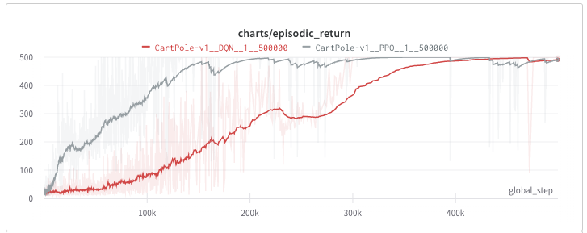
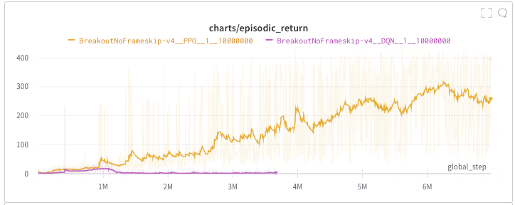

# Tao

[](https://github.com/amulil/tao)
[](https://github.com/psf/black)
[]()
## 算法原理

0. [深度强化学习（DRL）算法汇总](https://zhuanlan.zhihu.com/p/595383059)
1. [深度强化学习（DRL）算法 1 —— REINFORCE](https://zhuanlan.zhihu.com/p/574479257)
2. [深度强化学习（DRL）算法 2 —— PPO 之 Clipped Surrogate Objective 篇](https://zhuanlan.zhihu.com/p/574810519)
3. [深度强化学习（DRL）算法 2 —— PPO 之 GAE 篇](https://zhuanlan.zhihu.com/p/577598804)
4. [深度强化学习（DRL）算法 3 —— Deep Q-learning(DQN)](https://zhuanlan.zhihu.com/p/595728811)
5. [深度强化学习（DRL）算法 4 —— Deep Deterministic Policy Gradient (DDPG)](https://zhuanlan.zhihu.com/p/595568507)
6. [深度强化学习（DRL）算法 5 —— Twin Delayed Deep Deterministic Policy Gradient (TD3)](https://zhuanlan.zhihu.com/p/596086108)
7. []()
8. [深度强化学习（DRL）算法 附录1 —— 贝尔曼公式](https://zhuanlan.zhihu.com/p/581273520)
9. [深度强化学习（DRL）算法 附录 2 —— 策略迭代和价值迭代](https://zhuanlan.zhihu.com/p/595732361)
10. [深度强化学习（DRL）算法 附录 3 —— 蒙特卡洛方法（MC）和时序差分（TD）](https://zhuanlan.zhihu.com/p/595786697)

## 算法实现

- [x] PPO
  - [x] discrete action
  - [ ] continuous action
  - [x] atari
- [x] DDPG
- [ ] SAC
- [x] DQN
  - [x] discrete action
  - [x] atari
- [x] TD3

## 基准

- [x] tao
- [ ] cleanrl
- [ ] sb3
- [ ] openai/baselines

### [Tao baseline](https://wandb.ai/amulil/tao/reports/Tao-baseline--VmlldzozMjU0OTQ3)
-------
#### Cartpole-v1

#### atari/BreakoutNoFrameskip-v4


## 本地运行
```bash
git clone https://github.com/amulil/Tao.git && cd tao
poetry install
poetry run jupyter notebook # run examples in notebook
```

## 使用

```python
# train model
from tao import PPO
model = PPO(env_id="CartPole-v1")
model.learn()

# save model
import torch
is_save = True
if is_save:
    torch.save(agent.state_dict(), "./ppo.pt")
    
# load model
model = PPO(env_id="CartPole-v1")
model.load_state_dict(torch.load("./ppo.pt", map_location="cpu"))
model.eval()
```